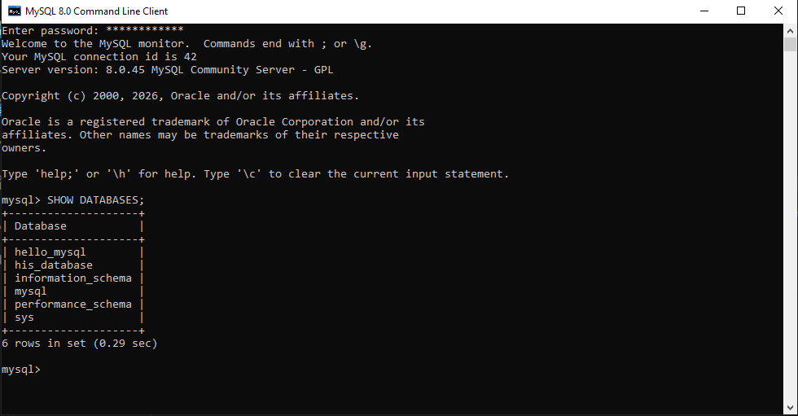
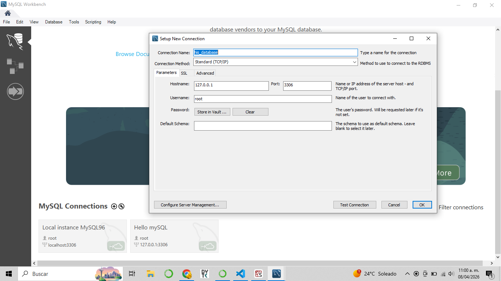
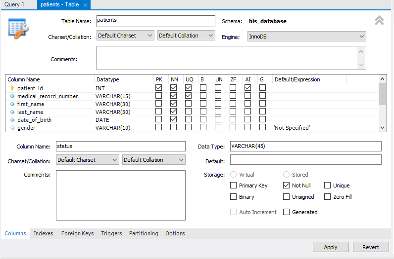
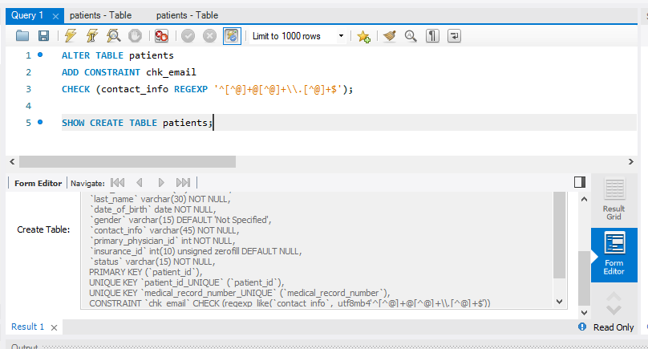

# HIS - RIS DATABASE (DB) CREATION 

[[_TOC_]]

## 1. DOWNLOAD SQL SERVER

MySQL Server is a open-source relational database management system (RDBMS) program that stores, manages, and retrieves data for applications.

An RDBMS (Relational Database Management System) is a type of software application that allows users to create, manage, and manipulate relational databases, which store data in a structured, tabular format (rows and columns). 
A Database Engine (or DB Motor/Storage Engine) is the underlying core component within a DBMS or RDBMS that specifically handles the task of actually writing, reading, updating, and deleting data on the physical disk or in memory.

RDBMS = DB Engine + administration + services + relational structure + user and permission management

  a) [MySQL Community (GPL) Downloads](https://dev.mysql.com/downloads/)
  b) MySQL Community Server 
  c) MySQL Installer Windows download - mysql-installer-community-8.0.45.0.msi (556 MB)
  d) Password configuration.
  e) Create the DB in MySQL 8.0 Command Line Client and validate it is running: 
    ```
       CREATE DATABASE his_database; 
       SHOW DATABASES;   -- lista que bases de datos tenemos
       USE his_database; -- Ahora todo lo que haga sera dentro de esta base de datos
       exit
    ```


## 2. DOWNLOAD MYSQL WORKBENCH

MySQL Workbench is a unified graphical user interface (GUI) tool for database architects, developers, and administrators to design, manage, and query MySQL databases.

SQL Server = the car's engine
Workbench = the dashboard and steering wheel for driving it

## 3. CREATE CONECTION TO DB 

a) Set the conection´s name : HIS Simulation
b) Set the IP in "Hostname". In thi case, the local IP: 127.0.0.1
c) Set port: 3306
d) Set Username:  root
e) Set the Schema´s name (Schema = Database): his_database



## 4. CREATE TABLES

Now we can star creating the tables according to the proposed schema in [ ris-pacs-foundations/5_ris-pacs_integration.md] (https://github.com/mrefugionv/ris-pacs-foundations/blob/main/5_ris-pacs_integration.md)

There are two ways to create tables:
1) Trough GUI / graphical user interface:
    1.1 Right-click on “Tables” in the Schema Browser >> "Create Table" 
    1.2 Configure table on the opened window:
        a) Table Name  in snake_case
        b) Configure columns:
            * Name
            * Data type - [SQL data types documentation](https://www.w3schools.com/sql/sql_datatypes.asp)
            * Characteristics (PK / NN / UQ / B / UN / ZF / AI / G), describe on: [sql_database_modification_commands.sql]()
            * Default Expression 

    

2) Through commands. Explained on: [sql_database_modification_commands.sql]()

```
CREATE TABLE `his_database`.`patients` (
  `patient_id` INT NOT NULL AUTO_INCREMENT,
  `medical_record_number` VARCHAR(15) NOT NULL,
  `first_name` VARCHAR(30) NOT NULL,
  `last_name` VARCHAR(30) NOT NULL,
  `date_of_birth` DATE NOT NULL,
  `gender` VARCHAR(15) NULL DEFAULT 'Not Specified',
  `contact_info` VARCHAR(45) NOT NULL,
  `primary_physician_id` INT NOT NULL,
  `insurance_id` INT ZEROFILL NULL,
  `status` VARCHAR(15) NOT NULL,
  PRIMARY KEY (`patient_id`),
  UNIQUE INDEX `patient_id_UNIQUE` (`patient_id` ASC) VISIBLE,
  UNIQUE INDEX `medical_record_number_UNIQUE` (`medical_record_number` ASC) VISIBLE);
```

### 5. CREATE CONSTRAINTS

SQL constraints are a set of rules applied to table columns to limit the type of data that can be entered. They ensure the accuracy, reliability, and integrity of the database by automatically rejecting any operation that violates these rules.

Constraints are usually expressed by CHECK() functions [Consult](https://www.w3schools.com/sql/sql_check.asp); in partnership with operators such as:  
* Logic operators: =, <>, >, <
* IN (...)
* LIKE
* REGEXP
* BETWEEN

The operators compare values that can be expressed, among others, as:
* LENGTH()
* LOWER()
* UPPER()
* String SQL Wildcards

####  FORMAT CONSTRAINT CREATION

In this example, a constraint for checking email format in contact_info column is added to patients table.  This type of constreaints are achieved by comparing them with regular expressions [(REGEXP)](https://www.geeksforgeeks.org/mysql/mysql-regular-expressions-regexp/) defined using specific characters [( SQL wildcards)] (https://www.w3schools.com/sql/sql_wildcards.asp). 

```
ALTER TABLE patients
ADD CONSTRAINT chk_email
CHECK (contact_info REGEXP '^[^@]+@[^@]+\\.[^@]+$');
```


Then check that te constraint was added correctly by consulting the current table configuration, writting the next query: 

```
SHOW CREATE TABLE patients;
```

#### CERTAIN VALUES CONSTRAINT - MODIFYING COLUMN NAME 

This example shows two qualities:
1. The column name is changed to avoid confusion with a reserved or restricted word in the SQL language. You can identify these words because the language highlights reserved words in blue.
2. A constraint is created so that only certain defined values can be entered in the patient_status column: active, inactive, or deceased.

```
ALTER TABLE patients
CHANGE status patient_status VARCHAR(15)
CHECK(patient_status IN ('active', 'inactive', 'deceased'));
```

### 6. MODIFYING TABLE -  ADDING DATETIME DEFAULT VALUES 

If we forgot to specify a certain property when creating a table, we can modify it using the ALTER TABLE command. In this case, we’re modifying the table to add a default value to the `report_datetime` column, which is set to the current system time in timestamp format.

For date-type data, there are two common formats:
datetime () - Stores the date as-is. These are used for clinical dates (which are not required to change).

For date-type data, there are two common formats:
* datetime() - Stores the date as-is. These are used for clinical dates (which are not expected to change).
* timestamp() - Can be adjusted according to time zone. These are used in audit tables, such as log tables.

```
ALTER TABLE report 
MODIFY report_datetime DATETIME DEFAULT CURRENT_TIMESTAMP;
```

### 6. CREATE TABLE RELATIONSHIPS 

For conceptual explanation visit [sql_foundations.md](sql_foundations.md)

#### 1: 1

Examples in this HIS DB:
* 1 study_id : 1 report_id
* 1 patient_id : 1 primary_physician
* 1 order_requet_id : 1 study_id

Commands explanation: 
* ADD CONSTRAINT →  adding a constraint
* fk_patient_physician → contraint´s name. The common format is by naming after the two fields being related: fk_column1_column2
* FOREIGN KEY (primary_physician_id) → local column
* REFERENCES physicians(physician_id) → the table (column) it references

```
ALTER TABLE  reports
ADD CONSTRAINT fk_report_study
FOREIGN KEY (study_id) REFERENCES studies(study_id);
```

#### 1:N

Example: 
* 1 physician : many order request.

Commands explanation (same as 1:1 relationships): 
* ADD CONSTRAINT →  adding a constraint
* fk_patient_physician → contraint´s name. The common format is by naming after the two fields being related: fk_column1_column2
* FOREIGN KEY (primary_physician_id) → local column
* REFERENCES physicians(physician_id) → the table (column) it references


```
ALTER TABLE  order_requests
ADD CONSTRAINT fk_order_physician
FOREIGN KEY (ordering_physician_id) REFERENCES physicians(physician_id);
```

#### N:M

Examples: 
* many ordering_physician : many  request_orders 
* many performing_technicians : many scheduled_appointments 

```
CREATE TABLE appointments_technicians (
    appointment_id INT,
    performing_technician_id INT,

    PRIMARY KEY (appointment_id, performing_technician_id),
    FOREIGN KEY (appointment_id) REFERENCES scheduled_appointments(appointment_id),
    FOREIGN KEY (performing_technician_id) REFERENCES physicians(physician_id)
);
```

So the tables that reference any of these columns are linked to the intermediate table
studies(performing_technician).

```
ALTER TABLE studies
ADD CONSTRAINT fk_study_technician
FOREIGN KEY (performing_technician_id) REFERENCES scheduled_appointments(performing_technician_id);
```

### SELF-REFERENTIAL: MEDICAL RECORD NUMBER (MRN) GENERATION

Systems often have an auto-incrementing ID from the internal database (patient_id), which may change during migrations, and a patient identification number, also known as a Medical Record Number (MRN), which is used by healthcare providers for record management and reporting. It must be stable and meaningful. 

In this case, we will auto-generate a unique MRN based on the patient_id, adding additional information such as the Mexican state, the year, and the identifier of the hospital where the patient was registered.

EMD= QRO-HOSP(codigo hospital)-2026(año)-paient_id.
Si patient_id = 7  entonces  MRN = QRO-HOSP01-2026-000007

```
DELIMITER $$

CREATE TRIGGER trg_generate_mrn
AFTER INSERT ON patients
FOR EACH ROW
BEGIN
    UPDATE patients
    SET medical_record_number = CONCAT(
        'QRO-',
        'HOSP01-',
        YEAR(CURDATE()),
        '-',
        LPAD(NEW.patient_id, 6, '0')
    )
    WHERE patient_id = NEW.patient_id;
END$$

DELIMITER ;
```

#### CASCADE INFORMATION REMOVAL


The use of these clauses is governed by the data integrity policy, which addresses questions such as:
What is considered “dependent”?
What can actually be deleted?

In our case, the following applies:
1. If a patient is deleted, the associated studies are NOT deleted.
2. If a study is deleted, the associated report is also deleted. 

```
ALTER TABLE studies
DROP FOREIGN KEY fk_study_patient;

ALTER TABLE studies
ADD CONSTRAINT fk_studies_patient
FOREIGN KEY (patient_id) REFERENCES patients(patient_id)
ON DELETE SET NULL;

```

```
ALTER TABLE reports
DROP FOREIGN KEY fk_report_study;

ALTER TABLE reports
ADD CONSTRAINT fk_report_study
FOREIGN KEY (study_id) REFERENCES studies(study_id)
ON DELETE CASCADE;
```

## 7. TRIGGERS

An SQL trigger is a specialized stored procedure that executes automatically in response to specific events on a table or view. They are primarily used to maintain data integrity, enforce business rules, and automate audit logging without requiring manual intervention or external application logic.


### AUDIT LOG

For critical tables (patients / studies / reports), we want to store important information for tracking changes during audits. 
The audit_log table contains the following fields:
* log_id - set to auto-increment by default. 
* user_id - @current_user_id; this is the user who logged into the system. It is set with each login.
´´´
SET @current_user_id = 5;
´´´
* action - whether it was delete/update/insert 
* entity_type - the name of the table (patients / studies / reports)
* entity_id - the primary key of the table record that was modified 
* datetime - defaulted to the current timestamp 
* previous value - previous value of the modified field (delete/update), null for (insert).
* new value - new value of the modified field (insert/update), null for (delete).

The conditions for the values to be stored in the log table were as follows:
1. When the action is an insert, the auto-incrementing identifiers from the relevant table are stored (patients - patient_id, studies - study_id, reports - report_id).
2. When the action is an update, the identifiers of the modified record (id) are saved, along with only the updated field, determined by a comparison [IF NOT (OLD.first_name <=> NEW.first_name)]. 
* Note: For TEXT data types, such as the findings_text field in the reports table, only fragments of the text are saved if there is sufficient contextual information, to avoid using too much memory. Some options are: 
   a) Save the first characters - LEFT(OLD.report_text, 200)
   b) Save the last characters - RIGHT(OLD.report_text, 200)
   c) Save the beginning and end - 
   ```
   CONCAT(
  ‘start:’, LEFT(OLD.report_text, 100),
  ‘ | end:’, RIGHT(OLD.report_text, 100)
   )
   ```
   d) Perform more complex comparisons to extract exactly what has changed.
In our case, it is considered that in a medical report:
  *  The beginning of the text usually contains more context (header, diagnosis, introduction).
  * If you always save the beginning, all logs have a comparable format. This maintains consistency and avoids noise at the end (signatures, repeated notes, less relevant information).

```
CONCAT('report_text:', LEFT(OLD.report_text, 200)),
CONCAT('report_text:', LEFT(NEW.report_text, 200))

```

3. When the action is a delete, the identifiers of the modified record (ID) and the most relevant information are saved. In our case, this will be as follows:
    * Patients - patient ID + first name + last name + date of birth (DOB); this allows us to identify unique individuals.
    * Studies - study_id + patient_id + study_datetime; this tells us who the study was performed on and when.
    * Reports - report_id + study_id + physician_id (radiologists); to know who interpreted a specific study and what results they reported finding.

#### INSERT

´´´     
DELIMITER $$

CREATE TRIGGER trg_patients_insert
AFTER INSERT ON patients
FOR EACH ROW
BEGIN
    INSERT INTO audit_log (
        user_id,
        log_action,
        entity_type,
        entity_id,
        new_value
    )
    VALUES (
        @current_user_id,
        'insert',
        'patients',
        NEW.patient_id,
        CONCAT('patient_id:', NEW.patient_id)
    );
END$$
´´´
#### UPDATE 

´´´
DELIMITER $$

CREATE TRIGGER trg_patients_update
AFTER UPDATE ON patients
FOR EACH ROW
BEGIN

    IF NOT (OLD.first_name <=> NEW.first_name) 
       OR NOT (OLD.last_name <=> NEW.last_name) THEN

        INSERT INTO audit_log (
            user_id,
            log_action,
            entity_type,
            entity_id,
            previous_value,
            new_value
        )
        VALUES (
            @current_user_id,
            'update',
            'patient',
            NEW.patient_id,
            CONCAT( 'name:', OLD.first_name, ' ', OLD.last_name),
            CONCAT('name:', NEW.first_name, ' ', NEW.last_name)
        );
    END IF;
    
    IF NOT (OLD.date_of_birth <=> NEW.date_of_birth) THEN
    INSERT INTO audit_log (
            user_id,
            log_action,
            entity_type,
            entity_id,
            previous_value,
            new_value
        )
    VALUES (
        @current_user_id,
        'update',
        'patient',
        NEW.patient_id,
        CONCAT('DOB:', OLD.date_of_birth),
        CONCAT('DOB:', NEW.date_of_birth)
        );
        END IF;
	
    IF NOT (OLD.gender <=> NEW.gernder) THEN
    INSERT INTO audit_log(
            user_id,
            log_action,
            entity_type,
            entity_id,
            previous_value,
            new_value
            )
	VALUES (
	        @current_user_id,
            'update',
            'patient',
            NEW.patient_id,
            CONCAT ('gender:',OLD.gender),
            CONCAT ('gender:', NEW.gender)
    );
    END IF;
    
    IF NOT (OLD.contact_info <=> NEW.contact_info) THEN
    INSERT INTO audit_log(
            user_id,
            log_action,
            entity_type,
            entity_id,
            previous_value,
            new_value
            )
	VALUES (
	        @current_user_id,
            'update',
            'patient',
            NEW.patient_id,
            CONCAT ('contact_info:',OLD.contact_info),
            CONCAT ('contact_info:', NEW.contact_info)
    );
    END IF;
    
    IF NOT (OLD.primary_physician_id <=> NEW.primary_physician_id) THEN
    INSERT INTO audit_log(
            user_id,
            log_action,
            entity_type,
            entity_id,
            previous_value,
            new_value
            )
	VALUES (
	        @current_user_id,
            'update',
            'patient',
            NEW.patient_id,
            CONCAT ('primary_physician_id:',OLD.primary_physician_id),
            CONCAT ('primary_physician_id:', NEW.primary_physician_id)
    );
    END IF;
    
	IF NOT (OLD.insurance_id <=> NEW.insurance_id) THEN
    INSERT INTO audit_log(
            user_id,
            log_action,
            entity_type,
            entity_id,
            previous_value,
            new_value
            )
	VALUES (
	        @current_user_id,
            'update',
            'patient',
            NEW.patient_id,
            CONCAT ('insurance_id:',OLD.insurance_id),
            CONCAT ('insurance_id:', NEW.insurance_id)
    );
    END IF;
    
    IF NOT (OLD.patient_status <=> NEW.patient_status) THEN
    INSERT INTO audit_log(
            user_id,
            log_action,
            entity_type,
            entity_id,
            previous_value,
            new_value
            )
	VALUES (
	        @current_user_id,
            'update',
            'patient',
            NEW.patient_id,
            CONCAT ('insurance_id:',OLD.patient_status),
            CONCAT ('insurance_id:', NEW.patient_status)
    );
    END IF;

END$$

DELIMITER ;
´´´

#### DELETE
´´´
DELIMITER $$

CREATE TRIGGER trg_patients_delete
AFTER DELETE ON patients
FOR EACH ROW
BEGIN
    INSERT INTO audit_log (
        user_id,
        log_action,
        entity_type,
        entity_id,
        old_value
    )
    VALUES (
        @current_user_id,
        'delete',
        'patient',
        OLD.patient_id,
        CONCAT('name:', OLD.first_name, '', OLD.last_name, 'DOB', OLD.date_of_birth)
    );
END$$
´´´
### NO OVERLAPING SCHEDULING 


### STATUS CHANGE 


scheduled appointment - cuando se asigne hora , cambiar en tabla order request el status a scheduled. 
Cuando cambie en report a final, que cambie en order request status a completed 


## 7. Hacer conexión desde python - sql_connection.py

## 8. Crear y traer registros  - Se pueden usar los comandosde sql_query_commands.sql


