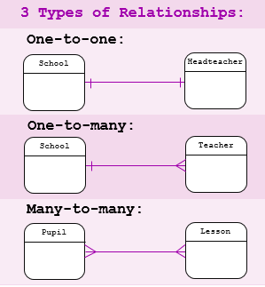

## SQL
.....
Servidor
Motor SQL

## RELACIONES ENTRE TABLAS DE BASE DE DATOS

Table relationships are associations established between tables in a relational database, used to link data across tables based on common fields. They minimize data redundancy by separating data into subject-based tables, enabling complex queries by connecting related data through primary and foreign keys.

Table relationships are associations established between tables in a relational database, used to link data across tables based on common fields. They minimize data redundancy by separating data into subject-based tables, enabling complex queries by connecting related data through primary and foreign keys. 
Microsoft Support
Microsoft Support
 +2
Types of Table Relationships
One-to-Many (1:N): The most common type. A single record in Table A can relate to multiple records in Table B. Example: One customer (1) places many orders (N).
Many-to-Many (M:N): Records in both tables link to multiple records in each other, usually requiring a "junction" or "pivot" table to work. Example: Products can be in many orders, and orders can contain many products.
One-to-One (1:1): Each record in Table A corresponds to only one record in Table B. Often used for splitting data into smaller tables for security or efficiency. 

AUTOREFERENCIAL :

Metabase
Metabase
 +3
Key Concepts in Relationships
Primary Key: A unique identifier for each row in a table.
Foreign Key: A field in one table that links to the primary key of another table, creating the connection.
Referential Integrity: Ensures that relationships between tables remain valid, preventing invalid data (e.g., ensuring a "many" record cannot be created without a valid "one" parent record)

Conceptos:
Clave Primaria
Cñlave Foránea

Relación 1:1
Una clave primaria de una tabla se relaciona con una clave primaria de otra tabla.
Un usuario solo tiene un dni
* Clave foránea.

Relación 1:n
Una empresa puede tener varios empleados.
* Clave foránea.

Relación n:n
Diferentes programadores saben diferentes lenguajes de programación.
Entonces cada lenguaje de programación puede estar asociado a diferentes programadores.
* Tabla de relaciones.

Autorefrenecia
Relaciones dentro de la misma tabla.
Tabla de empleados tienen mismo info todos pero tenemos campo de jefe en el que se indica que registro de la misma tabla es el jefe de cada uno de los empleados. 

# CONCEPTOS AVANZADOS
## INDEXES
estructura de base de datos que nos permite indexar una tabla, permitir al sistema de gestion de base de datos encontrar la información de manera más rápida, mejorando el rendimiento (como en las busqueda de paginas de un libro.)

Tipos de indices:
* Primarios - vinculado con la clave primaria de la tabla
* Unicos - asegura que dos filas de la tabla no tenga valores duplicados
* Compuestos - usar dos columnas de la tabla

Cuando sí y cuando no crear indices.
 Crear indices hace que la tabla pese más, va a ocupar mas espacio.
 A veces es más ineficiente segun en que momentos - permite busqueda más rapida, pero una escritura más lenta de datos (el indice al añadir resgistros se vuelve a regenerar para tener en cuenta ese nuevo dato).

Ejemplo: Presuponemos que en la tabla users usualmente se hacen las busquedas por nombre
CREATE INDEX idx_name ON users(name);

Quiero que sean unicos:
CREATE UNIQUE INDEX idx_name ON users(name);

La busqueda se hace por nombre y apellido:
CREATE INDEX idx_name_surename ON users(name, surename);

Eliminar indice:
DROP INDEX idx_name ON users;

## TRIGGER
Disparador - Evento que queremos que ocurra cuando pase algo en una tabla concreta
Ej. cuando un usuario actualice su nombre en la tabla, que se guarde el valor anterior en otra tabla.

1. se crea la nueva tabla - mail_history
2. Crear trigger:

delimiter 

|

CREATE TRIGGER tg_email
AFTER UPDATE ON users
FOR EACH row
BEGIN 
 IF OLD.email <> NEW.email THEN 
     INSERT INTO email_history(user_id, email)
     VALUES user(OLD.user_id, OLD.email);
 END IF;
END;

|

delimiter;

BEFORE/AFTER INSERT/DELETE/UPDATE 

Probar:

UPDATE users SET email="bhabhaba@hkk.gmail.com"  WHERE user_id = 1;

Eliminar trigger

DROP TRIGGER tg_email;

## VIEW
Representación virtual de una o más tablas. Una tabla que no es una tabla, simplificar consultas complejas. Consultas muchas veces esa misma consulta. (no se crea una tabla realmente). 
Tomar en cuenta que crear vistas tambien ocupa espacio (cada vez que se actualizan datos se tiene que regnerar la vista.)

CREATE VIEW v_adult_users AS
SELECT name, age
FROM users
WHERE age >= 18;

Consultar vista:
SELECT * FROM v_adult_users;

Eliminar vista:
DROP VIEW v_adult_users;

## PROCEDIMIENTO ALMACENADO
Querys guardados en favoritos.

Tipos:
* 
*

DELIMETER //
CREATE PROCEDURE p_all_users () 
BEGIN 
  SELECT * FROM users;
END ;

//

Para ejecutar:
EXEC / CALL

CALL p_all_users;

Procedimiento con parametros - lo llamo con algun parametro:
DELIMETER //
CREATE PROCEDURE p_age_users (IN age_param int) 
BEGIN 
  SELECT * FROM users WHERE age = age_param;
END ;
//

Llamar Procedimiento con parametro (trae los usuarios con edad mayor a 30):
CALL p_age_users(30); 

Eliminar procedimiento:
DROP PROCEDURE p_age_users;

## TRANSACCIONES
Transaccion es algo que se esta ejecutando en bloque y aseguran que lo que nosostros queremos ejecutar, solo se ejecuten en caso de que nosotros consideremos que se ha hecho bien.
sino es valida la transaccion, se hace un ROLL BACK - volver la base de datso a como estaba antes de que se ejecutara esa transacción (no terminar la ejecucion).
Si son correctas COMMIT.

START TRANSACTION
COMMIT
ROLL BACK

## CONCURRENCIA
Cuando varios usuarios intentan hacer lo mismo en una base de datos. Configurar reglas de concurrencia, se puede bloquera fila o tabla 
INTERBLOQUEO - Cuando intenta hacer dos cosas al mismo tiempo, la base de datos hace un INTERBLOCK (mecanismo para solucionar, deshace la accion de una de las transacciones.)
