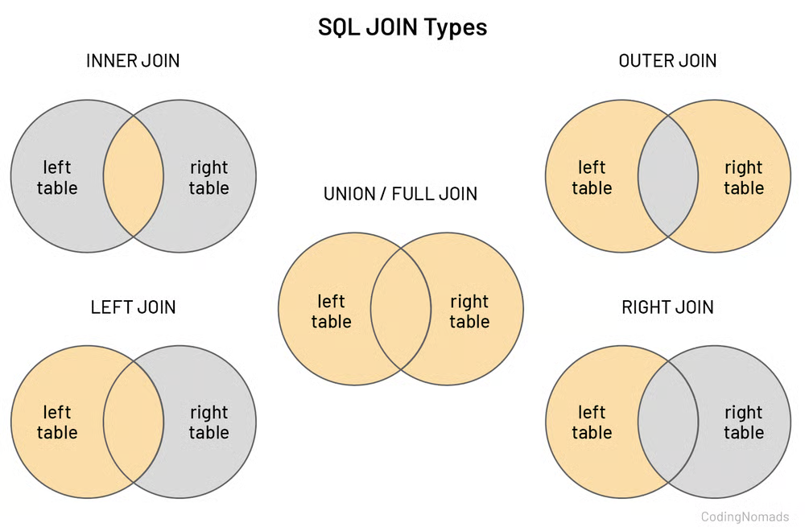

# SQL STATEMENTS DE CONSULTA

SELECT {agg / classificacion} (col 1 )  {particion} AS 'new_col_name'
FROM table1
LEFT/ FULL/ RIGHT/ INNER JOIN table2 ON table1.col = table2 .col
WHERE table#.col {comparacion} value {logico} table#.col {comparacion} value     *no agg
GROUP BY col  ** solo con agg
HAVING {agg} col  {comparacion} value {logico} {comparacion} value 
ORDER BY col DESC/ASC
LIMIT #filas ; 

{agg} = MIN , MAX, 
CONCAT :  SELECT CONCAT('Nombre: ', name, ', 'Apellidos: ', surname) AS 'Nombre Completo' FROM users;
, SUM *taernos los datos más procesada antes de que la procese la app (por ejemplo sum en lugar de hacer ciclos for o así en otro lenguajes de programación), DISTINCT, COUNT *solo cuanta los registros no nulos en el campo indicado, AVG **Usualmente, se usan solo el valor para este campo , no para sacar líneas completas de este valor. 
{classificacion} = RANK, ROW_NUMBER, LAG. LEAD, FIRST VALUE, LAST VALUE
{paticion}= OVER( PARTITION BY col2
                ORDER BY  col2
                ROW BETWEEN <start_bound> AND <end_bound>)
<baound> = UNBOUNDED PRECEDING/ FOLLOWING, N PRECEDING / FOLLOWING, CURRENT ROW
{comparcion} =  >, < , >= , <=, IS NOT NULL, IS NULL, LIKE , NOT LIKE , NOT ...=... 
     DINAMICOS % - cuando no conocemos valor exacto
       LIKE  - contiene o se parece a ... 
            WHERE email LIKE '%@gmail.com'
            WHERE email LIKE 'sara%'
            WHERE email LIKE '%@%'

{LOGICOS } = NOT, AND, OR, NOR , IN, BETWEEN

## JOINS
Para relacionar a combinar los datos que hay en dos tablas

### INNER
Obtener las filas comunes de ambas tablas en la columna indicada. 

SELECT * FROM table1
INNER JOIN table2
ON table1.col = table2.col ;

SELECT table1.colY , table2.colX ...   FROM table1
INNER JOIN table2
ON table1.col = table2.col ;

En tabla relación 1:1, 1 usuario: 1 dni. No se ven datos repetidos en la columna de clave.
Tabla con relación 1:n , 1 usuario : varias companias. Sí se ven datos repetidos en la relación multiple (company id)

En la mayoría de los motores de bases datos el JOIN trabajo como INNER JOIN:
 
SELECT * FROM table1
JOIN table2
ON table1.col = table2.col ;

RELACIONES N:M , tabla intermedia . Join con tres tablas. 

SELECT table1.colX , table2.colY.... FROM table_relacion
INNER JOIN table1 ON table_relacion.col = table1.col
INNER JOIN  table2 ON table_relacion.col2 = table2.col2

### LEFT
Todos los datos de la primera tabla y los de la segunda tabla que coincidan. Ejemplo: a todos los usuarios y su dni lo tengan o no . Rellena con nulos los criterios de busqueda que no tienen información.

SELECT * FROM users
LEFT JOIN dni
ON users.user_id = dni.user_id ;

SELECT table1.colX , table2.colY.... FROM table_relacion
LEFT JOIN table1 ON table_relacion.col = table1.col
LEFT JOIN  table2 ON table_relacion.col2 = table2.col2;

en otros motores de bases de datos : LEFT OUTER JOIN

### RIGHT

Ahora muestra todos los dni´s y y rellena los user que faltan

SELECT * FROM users
RIGHT JOIN dni
ON users.user_id = dni.user_id ;

* Se puede obtener los mismos resultados con RIGHT y LEFT , volteando el orden de las tablas, pero a nivel de tratamiento de datos y compresión es mejor llevar un orden.

### FULL  JOIN
El comando es UNION

SELECT users.user_id AS u_user_id, dni-user_id AS d_user_id
FROM users
LEFT JOIN dni
ON users.user_id = dni.user_id 
UNION
SELECT users.user_id AS user_id, dni.user_id AS d_user_id
FROM users
RIGHT JOIN dni
ON users.user_id = dni.user_id;

## NOT 

## SELECT
SELECT * FROM table_name; - Consultar todos los datos de una tabla
SELECT column_name  FROM table_name;  - Consultar una columna de una tabla
SELECT column_name_1, column_name_2  FROM table_name;  - Consultar varias columnas de una tabla

## DISTINCT
SELECT DISTINCT * FROM users; - trae los registros que son difrentes en todas tomadno en cuenta todas las columnas de la tabla

SELECT DISTINCT column_name FROM users; - trae los campos que son diferentes en todas tomando en cuenta la columna indicada y cual es su valor

## WHERE
delimitar con logica
SELECT * FROM table_name WHERE condition; 
SELECT column_name FROM table_name WHERE condition; 
SELECT DISTINCT column_name FROM table_name WHERE condition; 

## ORDER BY 
SELECT * FROM users ORDER BY age;
SELECT * FROM users ORDER BY age ASC;
SELECT * FROM users ORDER BY age DESC;

## LIMIT 
Para eficientizar consultas y no este buscando en millones de registros

## NULL
## IN
Busqueda identica - si falta una letra ya no aparece
SELECT * FROM user WHERE name IS 'brais';
SELECT * FROM table_name WHERE column_name IS 'target_string';

## BETWEEN
SELECT * FROM users WHERE age BETWEEN 20 AND 30;

## ALIAS
## GROUP BY
Agrupara los valores del campo segun nuestra funcion de agregación
SELECT COUNT(age), age WHERE age > 16 FROM users GROUP BY age ASC;
SELECT COUNT(age), age FROM users GROUP BY age ASC;
SELECT MAX(age) FROM users GROUP BY age; 

## HAVING
Hace limitaciones y operaciones logicas con los valores ya procedsados
SELECT age FROM users HAVING age > 6 -- los usuarios con edades mayores a 6
o
SELECT COUNT(age) FROM users HAVING COUNT(age) > 3 -muestra si el valor de count es mayor a 3
NO
SELECT COUNT(age) FROM user HAVING age > 6 -NO puede hacer esta operacion,seria con GROUP BY y WHERE  

## CASE   
Como si fuese un IF ELSE de programación 
NOta: Requiere coma y para que sea facil de enteneder un ALIAS

SELECT *,
CASE
  WHEN age > 18 THEN 'Es mayor de edad'
  WHERE age = 18 THEN 'Acaba de cumplir la mayoría de edad'
  ELSE 'Es menor de edad'
END AS '¿Es mayor de edad?'
FROM users;

SELECT *,
CASE
  WHEN age > 17 THEN True
  ELSE False
END AS '¿Es mayor de edad?'
FROM users;

## IFNULL 
SELECT name, surname IFNULL (age, 0) AS age FROM users;
Traerme el comnre y apellido de los usuarios, si en la columna edad hay nulos , coloca un 0  y quiero que siga llamandose la columna age

Fuentes:

https://w3schools.com/sql
https://www.youtube.com/watch?v=OuJerKzV5T0